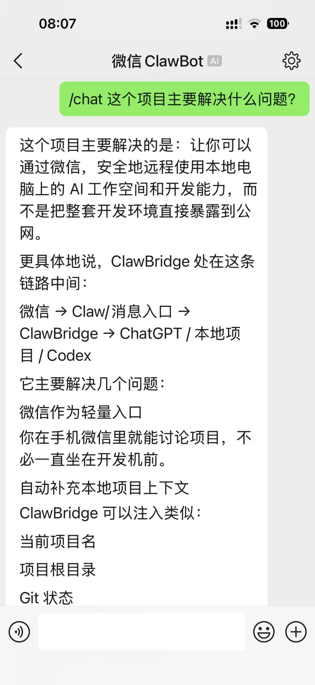
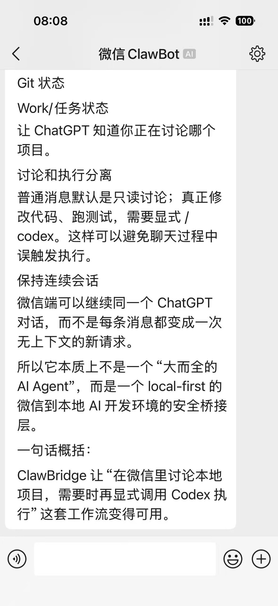

# SteerWX

**Continue your ChatGPT and Codex work from WeChat.**

*A lightweight WeChat companion for ChatGPT and Codex on your PC.*

**English** | [简体中文](README.zh-CN.md)

After leaving your computer, use WeChat to check ChatGPT Work status and results, continue the current project's ChatGPT conversation, and explicitly request local read-only Codex analysis when needed. No extra phone app is required. SteerWX runs on your own Windows PC; source code, logs, and long outputs stay there.

```text
WeChat → SteerWX → ChatGPT Work / ChatGPT Web / Codex CLI
```

Your ChatGPT, Codex, network, and regional access requirements still apply.

- **`/work` observes** local ChatGPT Work status and results.
- **`/chat` discusses** the current project with ChatGPT and lightweight local context, but does not execute code changes.
- **`/codex` explicitly analyzes** a configured repository with Codex CLI in a read-only sandbox.
- Detailed work, source code, logs, and long outputs stay on the PC; SteerWX does not require exposing the development machine directly to the public Internet.

If you only want one part of the workflow, the other capabilities remain optional.

> **Status: v0.2.0 Alpha / Early Stage**
> The complete first-time setup flow is currently verified on Windows only. SteerWX is still experimental and is not production-ready infrastructure. Tencent iLink / WeChat ClawBot is an external dependency whose account, session, binding, rate-limit, and delivery behavior may change independently of SteerWX.

SteerWX is an independent open-source project and is not affiliated with, authorized by, or endorsed by Tencent, WeChat, or OpenAI.

---

## See it in action

Ask about the local project directly from WeChat:

<p align="center">
  
</p>

For example:

```text
/chat What problem does this project solve?
```

SteerWX keeps the conversation tied to the current project context instead of treating every WeChat message as a completely unrelated request.

---

## What can SteerWX do?

```text
WeChat ClawBot
      ↕
  SteerWX
      ├─ /work  → local ChatGPT Work status
      ├─ /chat  → ChatGPT Web + project context
      └─ /codex → local Codex CLI (read-only analysis)
                    ↓
                local projects
```

The command boundary is deliberate:

- **`/work` observes** local Work facts, status, and results.
- **`/chat` discusses** the project with ChatGPT and may prepare a Codex handoff.
- **`/codex` explicitly analyzes** a configured local project with Codex in a read-only sandbox.

A `/chat` message that asks to modify code, run tests, commit, or deploy **does not automatically perform those actions**.

SteerWX is intentionally not a general-purpose agent framework. It does not provide model routing, RAG, long-term memory, or workflow orchestration, and it does not depend on QClaw or OpenClaw.

---

## Capabilities

| Capability | Purpose | Requirement |
|---|---|---|
| `/work` | Observe local ChatGPT Work facts, status, and results | Accessible local Work state |
| `/chat` | Discuss and analyze the current project with ChatGPT | Chrome with ChatGPT Web signed in |
| `/codex` | Explicitly start local read-only Codex analysis | Configured project + working Codex CLI |
| Git Context | Add on-demand, read-only Git facts to `/chat` | Git repository + Git CLI |
| WeChat transport | Send commands and receive results from WeChat | WeChat + Tencent iLink / WeChat ClawBot |

---

## Requirements

The complete first-time setup is currently verified on **Windows**. Linux and macOS are not yet accepted platforms.

Prepare only the dependencies required by the capabilities you plan to use:

- Python 3.11 or later;
- Google Chrome, for the dedicated ChatGPT Web profile;
- a ChatGPT Web account, only for `/chat` — SteerWX **does not use the OpenAI API**;
- WeChat and Tencent iLink / WeChat ClawBot, for WeChat transport;
- Codex CLI, with its own authentication/configuration complete, only for `/codex`;
- Git CLI and a Git repository, only for Git Context;
- one or more local project directories;
- locally accessible ChatGPT Work state, only for Work Observer.

Cloning the repository and running `python -m steerwx run` does not automatically enable every capability. For example, `/work` does not require ChatGPT Browser, while `/chat` does.

---

# First-time setup

## 1. Install SteerWX

```powershell
git clone https://github.com/samzhou1972/steerwx.git
cd steerwx
python -m pip install -e .
```

Confirm the CLI is available:

```powershell
python -m steerwx --help
```

Run the non-destructive first-run check at any time:

```powershell
python -m steerwx doctor
```

The doctor reports local setup gaps as `SETUP` rather than treating optional capabilities as failures. Use `python -m steerwx chat-browser doctor` when you want to verify the ChatGPT browser session itself.

---

## 2. Configure local projects

Runtime configuration is stored at:

```text
%LOCALAPPDATA%\SteerWX\config.toml
```

Copy `config.example.toml` to that location, then explicitly configure every project SteerWX may use:

```toml
[projects.steerwx]
root = "C:\\path\\to\\steerwx"
```

Here:

- `steerwx` is the logical project name;
- `root` is the real local directory.

`[projects.<name>].root` is the sole project-path authority for `/chat` context, Git Context, Work matching, and `/codex`.

From WeChat:

```text
/chat use steerwx
```

selects that configured project.

The first ordinary `/chat ...` message starts a ChatGPT conversation automatically. SteerWX keeps its conversation state internally; you do not need to create, copy, or bind a ChatGPT conversation URL.

SteerWX does not scan the disk to guess your projects. Do not commit personal runtime configuration, credentials, or browser profiles to Git.

---

## 3. Bind WeChat ClawBot

SteerWX uses Tencent iLink / WeChat ClawBot as its transport layer rather than a normal WeChat Web API.

Start the binding flow:

```powershell
python -m steerwx login
```

The terminal requests and displays a binding QR code. Then:

1. scan it with WeChat on your phone;
2. if WeChat displays a numeric verification code, enter it in the terminal;
3. finish the ClawBot binding flow;
4. keep the resulting credentials in local runtime state only.

---

## 4. Verify WeChat transport

Run the minimal transport smoke test:

```powershell
python -m steerwx echo
```

Then send this to WeChat ClawBot:

```text
hello
```

Expected reply:

```text
world
```

This verifies only:

```text
WeChat ↔ Tencent iLink ↔ SteerWX
```

Complete this step before diagnosing ChatGPT, Work, or Codex.

> API acceptance does not prove that the WeChat client actually received the message. See [External service limitations](#external-service-limitations).

---

## 5. Prepare the ChatGPT browser session

SteerWX uses a dedicated Chrome profile:

```text
%LOCALAPPDATA%\SteerWX\browser\chrome-profile
```

Run the one-time login setup:

```powershell
python -m steerwx chat-browser setup
```

This launches normal system Chrome with the dedicated profile.

In the opened browser:

1. manually sign in to `chatgpt.com`;
2. confirm ChatGPT works;
3. close that Chrome window.

The authenticated session remains in the dedicated profile.

SteerWX never asks for, collects, or stores your ChatGPT password.

> Being signed in to your everyday Chrome or Edge does not mean the SteerWX profile is signed in. SteerWX does not use your daily Edge profile or a browser extension.

---

## 6. Verify ChatGPT Browser

After closing the login browser, run:

```powershell
python -m steerwx chat-browser doctor
```

A ready environment reports `PASS` for the browser and ChatGPT readiness checks.

Then run the end-to-end browser check:

```powershell
python -m steerwx chat-browser doctor --send
```

On success:

```text
STEERWX_BROWSER_OK
```

For first-time setup, use the doctor command before diagnosing `/chat` itself.

---

## 7. Prepare Codex CLI (optional)

If you want to use `/codex`, install and authenticate Codex CLI separately.

SteerWX explicitly runs configured projects in a read-only sandbox:

```text
codex exec --sandbox read-only
```

SteerWX does not provide a Codex/OpenAI account and does not silently route ordinary `/chat` messages into Codex execution.

---

## 8. Start SteerWX

```powershell
python -m steerwx run
```

This starts the long-running bridge process.

If the PowerShell window stops, SteerWX stops too. If WeChat no longer receives replies, first confirm that the bridge process is still running.

---

## Quick setup checklist

To start using `/chat`:

1. Clone and install SteerWX.
2. Configure at least one local project in `%LOCALAPPDATA%\SteerWX\config.toml`.
3. Bind WeChat with `python -m steerwx login`.
4. Prepare the dedicated Chrome profile with `python -m steerwx chat-browser setup`, sign in to ChatGPT, then close that Chrome window.
5. Start SteerWX with `python -m steerwx run`.
6. In WeChat, send `/chat use <project>` (for example, `/chat use steerwx`).
7. Send an ordinary `/chat ...` message. SteerWX creates and manages the ChatGPT conversation automatically.

If a step fails, use `python -m steerwx echo` to check WeChat transport and `python -m steerwx chat-browser doctor` to check browser readiness. `doctor --send` is an optional browser test. Codex CLI is needed only for explicit `/codex` requests.

---

# WeChat commands

| Command | Meaning |
|---|---|
| `/work status` | Show the latest Work status |
| `/work last` | Show the latest Work activity |
| `/work result` | Show the latest Work result |
| `/work watch` | Enable one brief notification when a whole task first reaches `COMPLETE` |
| `/work unwatch` | Disable Work completion notifications |
| `/codex <project> <task>` | Explicitly start read-only Codex analysis for a configured project |
| `/chat use <project>` | Select the configured local project for future `/chat` messages |
| `/chat <message>` | Discuss or analyze with ChatGPT; it does not execute code changes |
| `/chat status` | Show local chat-session status |
| `/chat reset` | End the current ChatGPT conversation, keep the project, and start a new conversation on the next `/chat` |

---

# A longer conversation example

A `/chat` conversation can continue across messages and keep the selected project context:

<p align="center">
  
</p>

The intended workflow is simple:

**discuss with `/chat`, observe with `/work`, and explicitly use `/codex` only when local analysis is actually needed.**

---

# WeChat outbound policy

WeChat is treated as a **control, short-summary, and completion-reminder channel**, not a long-log channel.

Current policy:

- a business response normally sends at most one WeChat message;
- the outbound hard cap is 1000 Unicode characters;
- automatic multipart / numbered-message chunking is disabled;
- `/chat` asks ChatGPT for a short summary by default;
- a Codex handoff of 1000 characters or fewer is provided in full;
- a Codex handoff over 1000 characters is neither truncated nor split; SteerWX sends a notice to continue on the PC;
- full reports, logs, tracebacks, test output, and detailed development work stay on the PC;
- a proactive Work notification is sent only when a whole task first reaches `COMPLETE`, and remains intentionally brief.

---

# Runtime data and credentials

Local runtime state lives under:

```text
%LOCALAPPDATA%\SteerWX
```

### Upgrading from ClawBridge

Version 0.2.0 still accepts `python -m clawbridge` and the old `clawbridge` command. Use `python -m steerwx` for new instructions. Existing `%LOCALAPPDATA%\ClawBridge` data is used automatically while `%LOCALAPPDATA%\SteerWX` does not exist, so the existing configuration, Chrome profile, chat session, WeChat/iLink metadata, and route state remain available. Legacy `CLAWBRIDGE_*` environment variables and existing OS keyring entries are also read.

To copy local data into the new directory, first stop the service and close its dedicated Chrome window, then run:

```powershell
python -m steerwx migrate-data
python -m steerwx doctor
```

The copy keeps the old directory, refuses to overwrite an existing SteerWX directory, and stops if Chrome profile lock markers are present. A copied config that names the old default Chrome profile is resolved to its copy under SteerWX; custom profile paths are kept. If you set `CLAWBRIDGE_HOME`, `CLAWBRIDGE_CONFIG`, or `CLAWBRIDGE_CHAT_PROFILE`, review those explicit overrides after copying. If `SteerWX.migrating` remains after an interrupted copy, inspect it before retrying. Do not delete the old directory until the new installation has been verified locally. This migration does not change your configured project names or project roots.

It may contain:

- `config.toml`;
- `chat\session.json`;
- the dedicated Chrome profile;
- WeChat / iLink account metadata;
- route/runtime state.

ChatGPT login data stays in the dedicated Chrome profile. The iLink token is stored through the local credential store / OS keyring.

**Never commit tokens, credentials, profiles, session state, or personal runtime configuration to Git.**

---

# External service limitations

Tencent iLink / WeChat ClawBot is an external transport service. Tencent controls availability, rate limits, message volume/frequency, session and context validity, binding state, and actual client delivery behavior. These may change independently of SteerWX.

In particular:

- Tencent does not publish a stable fixed rate-limit threshold for this use case, so do not rely on a permanent “N messages per minute” rule;
- short bursts or frequent outbound messages may be limited, which is why SteerWX uses short messages and low-frequency proactive notifications;
- `sendmessage ret=0` or similar API acceptance only means that the server accepted the request — it does not guarantee delivery to the WeChat client;
- SteerWX records such calls as `ACCEPTED_UNCONFIRMED` and does not densely auto-retry delivery that has not been confirmed;
- supervised real WeChat E2E delivery has been verified, but account-specific binding or client-delivery anomalies may still occur independently of SteerWX.

---

# Architecture

```text
WeChat ClawBot
      ↕
SteerWX Core
      ├─ M1 Work Observer
      ├─ M2 Codex Executor
      └─ M3 Conversation Core
             └─ ChatGPT Browser Driver
```

## M3-A: ChatGPT Browser

Runtime browser automation uses Playwright with the same dedicated profile used during manual Chrome login.

It waits for a new assistant response, stable non-empty text, and the corresponding completion signals.

## M3-B: Local conversation session

The default session stores its canonical ChatGPT `/c/...` URL and up to 24 recent audit messages at:

```text
%LOCALAPPDATA%\SteerWX\chat\session.json
```

Later runs reopen that exact thread.

If an authenticated ChatGPT page explicitly confirms that the saved thread was not found or is inaccessible, SteerWX creates one new conversation, keeps the project binding, and sends the current `/chat` message once. Other browser, login, network, and ambiguous page failures still stop with an error. SteerWX does not search the ChatGPT sidebar or inject artificial history.

## M3-C: Lightweight project context

Project context is demand-driven and read-only.

It may summarize:

- Work state;
- Git branch;
- working tree clean/dirty state;
- changed-file count;
- last local commit.

It does **not** perform:

- `git fetch` / `pull`;
- checkout;
- commit;
- source-code search;
- project execution.

## M3-D: WeChat conversation bridge

Only one `/chat` request drives the default browser session at a time.

Control commands do not start the browser.

The complete assistant response remains local; WeChat receives only the bounded result defined by the outbound policy.

---

# Current development status

Current acceptance state:

- M0 — WeChat / iLink Transport: automated acceptance passed;
- M1 — Work Observer: automated acceptance passed;
- M2 — Codex Executor: automated acceptance passed;
- M3-A / B / C / D: automated acceptance passed;
- M0 and M3-D: supervised real WeChat E2E verification completed.

This is still an early-stage project. In particular, the WeChat transport depends on Tencent iLink / ClawBot, so the status above should not be interpreted as a production SLA.

---

# Why SteerWX exists

SteerWX solves a very specific problem:

> Once development work increasingly depends on ChatGPT, Codex, and local AI tools, how can you leave the computer and still know what is happening, continue the discussion, and explicitly trigger local analysis when needed?

The answer here is not another full remote IDE, and it is not exposing the development machine directly to the public Internet.

WeChat is already on the phone.

SteerWX therefore uses it as a lightweight entry point:

**use `/chat` to discuss, `/work` to observe, and `/codex` only when local analysis is explicitly required.**

The project intentionally stays small and opinionated. If that workflow matches your needs, use it as-is. If not, fork it and adapt the bridge to your own local AI setup.

---

# Contributing

Issues, bug reports, documentation improvements, and pull requests are welcome.

Before contributing, please read:

- [CONTRIBUTING.md](CONTRIBUTING.md)
- [SECURITY.md](SECURITY.md)

---

# License

SteerWX is released under the [MIT License](LICENSE).

If SteerWX is useful to you, a ⭐ Star helps other developers with the same problem discover the project.
